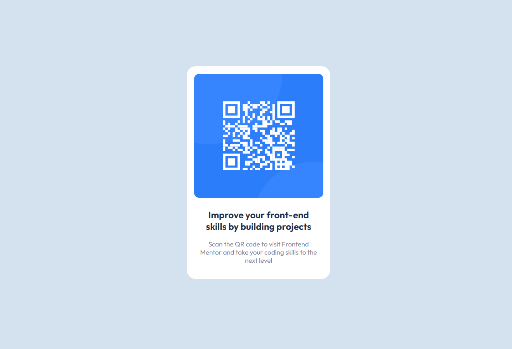

# Frontend Mentor - QR code component solution

This is a solution to the [QR code component challenge on Frontend Mentor](https://www.frontendmentor.io/challenges/qr-code-component-iux_sIO_H). Frontend Mentor challenges help you improve your coding skills by building realistic projects.

## Table of contents

- [Overview](#overview)
  - [Screenshot](#screenshot)
  - [Links](#links)
- [My process](#my-process)
  - [Built with](#built-with)
- [Author](#author)

## Overview

### Screenshot

### Links

- Solution URL: [The Repository: ](https://github.com/NotMazkDev/QR-FrontendMentor-Challenge)
- Live Site URL: [The Live Server: ](https://qr-fontendmentos-page.netlify.app/)

## My process

### Built with

- Semantic HTML5 markup
- CSS custom properties

## Author

- Frontend Mentor - [@NotMazkDev](https://www.frontendmentor.io/profile/NotMazkDev)
- Twitter - [@MazkDev](https://www.twitter.com/MazkDev)
